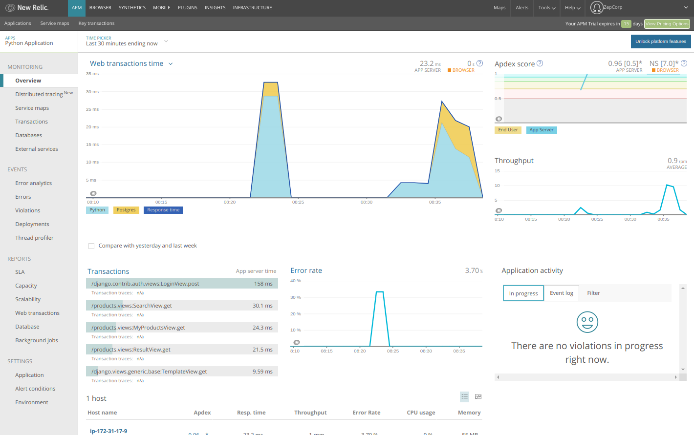
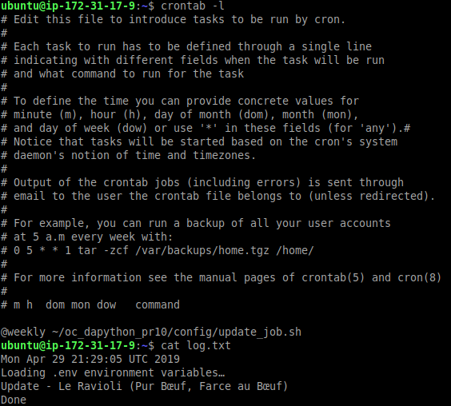

# Déployez votre application sur un serveur comme un pro !

[Application déployée sur AWS](http://18.222.24.163/)

[Tableau Trello](https://trello.com/b/OKalfHad/ocdapythonpr10)

[Repo Github](https://github.com/Zepmanbc/oc_dapython_pr10)

## Décomposition du `settings.py` pour les différents environnements

Création de settings pour:

* [le développement (version de base)](https://github.com/Zepmanbc/oc_dapython_pr10/blob/master/purbeurre/purbeurre/settings/__init__.py)
* [Heroku](https://github.com/Zepmanbc/oc_dapython_pr10/blob/master/purbeurre/purbeurre/settings/heroku_settings.py)
* [AWS](https://github.com/Zepmanbc/oc_dapython_pr10/blob/master/purbeurre/purbeurre/settings/aws_settings.py)
* [Pytest](https://github.com/Zepmanbc/oc_dapython_pr10/blob/master/purbeurre/purbeurre/settings/test_settings.py)
* [Travis](https://github.com/Zepmanbc/oc_dapython_pr10/blob/master/purbeurre/purbeurre/settings/travis_settings.py)

## Déploiement

### Création d'une instance EC2 sur AWS

Modification du "Groupe de sécurité" pour permettre l'entrée en HTTP (port 80)

Récupération du fichier *pem*

Connexion ssh:

    ssh -i "~/.AWS/zepman_air13.pem" ubuntu@ec2-18-222-24-163.us-east-2.compute.amazonaws.com

Mise à jour des dépôts et installation de pyenv (installation et activation de Python 3.7.2), postgresql, nginx et supervisor

    sudo apt-get update && sudo apt-get upgrade
    sudo apt-get install python3-pip python3-dev libpq-dev postgresql postgresql-contrib nginx supervisor virtualenv

### Copie du repo github et creation de l'environnement virtuel

    git clone https://github.com/Zepmanbc/oc_dapython_pr10.git
    cd oc_dapython_pr10
    virtualenv env -p python3
    source env/bin/activate

### Création des variables d'environnement pouvoir faire la migration
    export ENV=AWS
    export DB_NAME=purbeurre
    export DB_USER=pb_sql_user
    export DB_PASSWORD=***********
    export SECRET_KEY=[SECRET_KEY]
    export DJANGO_SETTINGS_MODULE=purbeurre.settings.aws_settings

Installation des dépendences

    pip install -r config/requirements.txt

le fichier a été obtenu avec cette commande

    pipenv run pip freeze > config/requirements.txt

#### Configuration de postgres

Creation d'un utilisateur et d'une base dans postgres

    sudo -u postgres psql
    CREATE DATABASE purbeurre;
    CREATE USER pb_sql_user WITH PASSWORD '***********';

Modifications pour améliorer la performance des requêtes (cf tuto)

    ALTER ROLE pb_sql_user SET client_encoding TO 'utf8';
    ALTER ROLE pb_sql_user SET default_transaction_isolation TO 'read committed';
    ALTER ROLE pb_sql_user SET timezone TO 'Europe/Paris';

Donne les droits à l'utilisateur sur la base *purbeurre*

    GRANT ALL PRIVILEGES ON DATABASE purbeurre TO pb_sql_user;

### Collecte des fichiers static, migration, collecte de produits

    python ~/oc_dapython_pr10/purbeurre/manage.py collectstatic
    python ~/oc_dapython_pr10/purbeurre/manage.py migrate
    python ~/oc_dapython_pr10/purbeurre/manage.py fillindb 50

### Creation d'un super utilisateur

    python ~/oc_dapython_pr10/purbeurre/manage.py createsuperuser

### Configuration de Nginx

Fichier de configuration Nginx (config/nginx/purbeurre.conf)

    server {

        listen 80;
        server_name 18.222.24.163;
        root /home/ubuntu/oc_dapython_pr10/purbeurre/

        location / {
            proxy_set_header Host $http_host;
            proxy_set_header X-Forwarded-For $proxy_add_x_forwarded_for;
            proxy_redirect off;
            if (!-f $request_filename) {
                proxy_pass http://127.0.0.1:8000;
                break;
            }
        }

        location /static {
            alias /home/ubuntu/oc_dapython_pr10/purbeurre/staticfiles/;
        }
    }

Création du lien symbolique vers le fichier de configuration puis rechargement de nginx

    sudo ln -s ~/oc_dapython_pr10/config/nginx/purbeurre.conf /etc/nginx/sites-enabled
    sudo service nginx reload

### Configuration de supervisor

Création du fichier de [configuration de *supervisor*](https://github.com/Zepmanbc/oc_dapython_pr10/blob/master/config/supervisor/purbeurre-gunicorn.conf)

    [program:purbeurre]
    directory=/home/ubuntu/oc_dapython_pr10/
    command=/home/ubuntu/oc_dapython_pr10/env/bin/gunicorn --chdir purbeurre purbeurre.wsgi:application
    autostart = true
    autorestart = true
    user=ubuntu
    environment = ENV=AWS,
        DB_NAME=purbeurre,
        DB_USER=pb_sql_user,
        DB_PASSWORD=***********,
        SECRET_KEY=[SECRET_KEY],
        DJANGO_SETTINGS_MODULE=purbeurre.settings.aws_settings

    [supervisord]
    environment=LC_ALL='en_US.UTF-8',LANG='en_US.UTF-8'

Création d'un lien symbolique vers le dossier de configuration et prise en compte de la nouvelle configuration

    sudo ln -s ~/oc_dapython_pr10/config/supervisor/purbeurre-gunicorn.conf /etc/supervisor/conf.d/
    sudo supervisorctl reread
    sudo supervisorctl update
    sudo supervisorctl status

## Mise en place de Travis

Fichier de configuration

[*.travis.yml*](https://github.com/Zepmanbc/oc_dapython_pr10/blob/master/.travis.yml)

Interface de Travis

Et ajout de [coveralls](https://coveralls.io/github/Zepmanbc/oc_dapython_pr10)

## Monitoring

### Mise en place de Newrelic

Création du fichier de configuration

    newrelic-admin generate-config <your-key-goes-here> newrelic.ini

Modification de la commande de démarrage dans supervisor

    command = /home/ubuntu/oc_dapython_pr10/env/bin/newrelic-admin run-program gunicorn --chdir purbeurre purbeurre.wsgi:application
    environment = NEW_RELIC_CONFIG_FILE=/home/ubuntu/oc_dapython_pr10/newrelic.ini

### Mise en place de Sentry

installation du package

    pip install --upgrade sentry-sdk==0.7.11

Ajout de la configuration dans *settings/aws_settings.py*

    import sentry_sdk
    from sentry_sdk.integrations.django import DjangoIntegration

    sentry_sdk.init(
        dsn="https://4cc8d88b64444388a3fbbc92cf017305@sentry.io/1445027",
        integrations=[DjangoIntegration()]
    )

Exemple avec une url modifiée

https://sentry.io/share/issue/6e936250d22a4019a08309cadfbe2f17/

Mise en place du login sur les recherches des utilisateurs

[*purbeurre/products/views.py*](https://github.com/Zepmanbc/oc_dapython_pr10/blob/master/purbeurre/products/views.py)

    from sentry_sdk import capture_message, configure_scope
    (...)
    class SearchView(ListView):
    (...)
    def get_queryset(self):
        with configure_scope() as scope:
            if '_auth_user_id' in self.request.session._session:
                scope.user = {
                    "email": User.objects.get(pk=self.request.session._session['_auth_user_id']).email
                }
            scope.level = 'info'
            capture_message('New search')

        return Product.objects.filter(
            product_name__icontains=self.request.GET['query']).\
                order_by('product_name')

## Automatisations

Script qui lance la mise à jour des données : *update_job.sh*

    echo $(date) >> ~/log.txt
    python ~/oc_dapython_pr10/purbeurre/manage.py fillindb 0 >> ~/log.txt 2>&1

Tache cron qui s'exécute toutes les semaines

    @weekly ~/oc_dapython_pr10/config/update_job.sh

le crontab sur le serveur et le log avec 1 produit qui a été mis à jour

